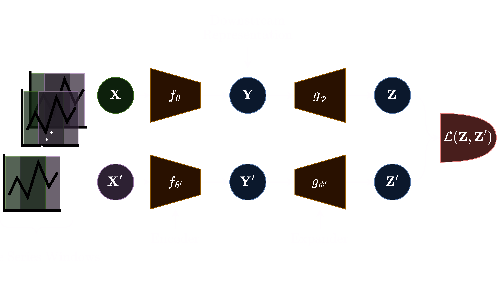

# T-VICReg: Self-Supervised Learning for Seizure Detection
<!-- 

  
  <em style="font-size: small; opacity: 0.3;">Image generated by DALL·E 3</em>

 -->

## Introduction
This codebase is the result of my work with [T-CAIREM Summer Studentship](https://tcairem.utoronto.ca/news/t-cairems-2023-ai-medicine-summer-student-program-launches-29-participants) from the Temerty Faculty of Medicine, University of Toronto to conduct research at the intersection of AI and neuroscience at the Neural Systems & Brain Signal Processing Lab. Project paper can be found [here](https://xaviermootoo.com/s/T_VICReg-xyjd.pdf).

As the result, we have developed T-VICReg, a novel self-supervised learning (SSL) method for time series, enabling learned representations to be partially invariant to translations in time. These representations aim to capture information relevant to the past and the future, which is hypothesized to produce representations capable of capturing state transitions, useful for a variety of classification and prediction tasks. We validate our method on the OpenNeuro dataset ds003029 containing iEEG signals from epilepsy patients on the task of binary seizure classification (ictal, nonictal) and multiclass seizure detection (preictal, ictal, postictal). Fine-tuning the encoderfrom T-VICReg resulted in Top-1 accuracies of92.92% and 89.26%, compared to the supervised baseline with Top-1 accuracies of **89.23%** and **84.07%**, for the binary and multiclass tasks respectively. T-VICReg is noncontrastive, augmentation-free, and is compatible with continuous and discrete time series, allowing for flexible use in many contexts.

The GNN architecture comprises of Edge-Conditioned Convolution (ECC) and Graph Attention Network (GAT) layers, utilizing PyTorch and PyTorch Geometric libraries for standard deep learning and GNN implementation. For a more detailed description of our research, see [projects/ssl-seizure-detection](https://www.xaviermootoo.com/projects/ssl-seizure-detection).

For more information on SSL and GNNs, please refer to the relevant papers:
> - Variance-Invariance-Covariance Regularization (VICreg) [(Bardes et al., 2022)](https://arxiv.org/abs/2105.04906)
> - A Path Towards Autonomous Machine Intelligence [(Lecun, 2022)][def]
> - Edge-Conditioned Convolution (ECC): [(Simonovsky & Komodakis, 2017)](https://arxiv.org/abs/1704.02901)
> - Graph Attention Layer (GAT): [(Veličković et al., 2018)](https://arxiv.org/abs/1710.10903)

## Table of Contents
0. [T-VICReg](#t-vicreg)
1. [Installation](#installation)
2. [Data](#data)
3. [Usage](#usage)
4. [File Descriptions](#file-descriptions)
5. [License](#license)
6. [Contact](#contact)

## T-VICReg

The T-VICReg loss defined in the [paper](https://xaviermootoo.com/s/T_VICReg-xyjd.pdf), given by:

$$\mathcal{L}(\mathbf{Z}, \mathbf{Z}') = \lambda \mathcal{L}_{\text{inv}}(\mathbf{Z}, \mathbf{Z}') +\mu \mathcal{L}_{\text{var}}(\mathbf{Z}, \mathbf{Z}') +\nu\mathcal{L}_{\text{cov}}(\mathbf{Z}, \mathbf{Z}')$$

is implemented in [`loss.py`](ssl_seizure_detection/src/modules/loss.py) given by the `VICRegT1Loss` nn.Module.

  <picture>
    <source media="(prefers-color-scheme: dark)" srcset="./ssl_seizure_detection/assets/T-VICreg_dark.png">
    <source media="(prefers-color-scheme: light)" srcset="./ssl_seizure_detection/assets/T-VICReg_light.png">
    
  </picture>

  <em>The T-VICReg pipeline.</em>

## Installation
For detailed setup instructions and environment configuration, please see our [installation guide](./INSTALL.md).

## Data
Processed data formatted as PyTorch Geometric Data objects is not yet available for release. Meanwhile, the initial intracranial electroencephalogram (iEEG) dataset utilized for this project is publicly accessible on OpenNeuro, identified by Accession Number [ds003029](https://openneuro.org/datasets/ds003029/versions/1.0.6). From ds003029, we selected 26 patients out of the 88 available in the dataset. For each patient iEEG signal, we divided the signal into time windows of equal length, and for each window an initial graph representation was constructed with the following method. The initial graph representations are fully connected graphs, with the nodes corresponding to individual electrodes. To construct the edge features, for each electrode pair, we computed the Pearson correlation, phase-lock value (PLV), and the coherence, giving us edge features of dimension 3. To construct the node features, we used the average energy of the electrode, and the average energies at various frequency bands; due to variability in the iEEG data format, there may have been more or less frequency bands available for certain patients, thus node features dimensions varied between $7-9$ (dependent on the patient). From this, we converted the data to the standard [PyTorch Geometric Data format](https://pytorch-geometric.readthedocs.io/en/latest/generated/torch_geometric.data.Data.html#torch_geometric.data.Data) of `[edge_index, x, edge_attr, y]` where `edge_index` is a tensor defining the graph structure (similar to a binary adjacency matrix), `x` is the node feature tensor, `edge_attr` is the edge feature tensor, and `y` is the target label tensor taking on values $0$ or $1$ for binary classification of ictal (seizure) or nonictal (no seizure); and took on values $0,1,$ or $2$ for preictal (before seizure), ictal (seizure), and postictal (after seizure) respectively for multiclass classification. Due of the heterogeneity of the iEEG data from patient to patient (e.g., different number of electrodes, different placement of electrodes) model training and evaluation was conducted intra-patient, i.e., a separate model was created for each patient.

## Usage
To run the entire pipeline, please refer to the `train()` function in [`train.py`](ssl_seizure_detection/src/train/train.py) and the relevant docstring. Please see the notebook [`train.ipynb`](ssl_seizure_detection/notebooks/models/train.ipynb) for guidance on how to train each model. The [`main.py`](ssl_seizure_detection/src/main.py) script is optimized for HPC on the Cledar cluster (Digital Research Alliance of Canada), and is not recommended for general use. For a tutorial on PyTorch Geometric and customized GNN models, please refer to [`tutorial.ipynb`](ssl_seizure_detection/notebooks/models/tutorial.ipynb). To see how the initial graph representations are created, please refer to [`preprocess.ipynb`](ssl_seizure_detection/notebooks/data/preprocess.ipynb). For a information on the transfer learning process (implemented in [`train.py`](ssl_seizure_detection/src/train/train.py)), please refer to [`transfer.ipynb`](ssl_seizure_detection/notebooks/models/transfer.ipynb). 

## File Descriptions

- **[`models.py`](ssl_seizure_detection/src/modules/models.py)**: Contains self-supervised models: relative_positioning, temporal_shuffling, CPC (to be added), and VICReg (to be added); and supervised models: supervised (base model), downstream1, and downstream2.
- **[`train.py`](ssl_seizure_detection/src/train/train.py)**: Implements the training loop for both self-supervised and supervised models. Includes logging with Weights and Biases (highly recomended). For a guide on how to train each model please see [`train.ipynb`](ssl_seizure_detection/notebooks/models/train.ipynb).
- **[`main.py`](ssl_seizure_detection/src/main.py)**: The primary script to run the training pipeline in parallel on multiple patients, optimized for Cedar cluster resources. 
- **[`preprocess.py`](ssl_seizure_detection/src/data/preprocess.py)**: Includes helper functions for all preprocessing tasks, such as converting initial graph representations to PyG-compatible structures.
- **[`patch.py`](ssl_seizure_detection/src/data/patch.py)**: Patches pre-existing Numpy data from our lab to the PyG-compatible format, not recommended for general use unless your existing data fits the specifications as outlined in [`preprocess.ipynb`](ssl_seizure_detection/notebooks/data/preprocess.ipynb).

## Acknowledgements
I would like to sincerely thank both [Dr. Alan A. Díaz-Montiel](https://github.com/adiazmont) and [Dr. Milad Lankarany](https://www.uhnresearch.ca/researcher/milad-lankarany) for their continued support throughout this research project and for their expert guidance. I am also extremely grateful for the support from the [Temerty Faculty of Medicine, University of Toronto](https://temertymedicine.utoronto.ca/) through the  [T-CAIREM](https://tcairem.utoronto.ca/) Summer Studentship, which allowed me to focus on this work.

I'd also like to extend my gratitude to the researchers and institutions for their generosity in sharing their iEEG data through OpenNeuro [ds003029](https://openneuro.org/datasets/ds003029/versions/1.0.6). Special thanks to:

- Department of Biomedical Engineering, Johns Hopkins University, Baltimore, United States
- Epilepsy Center, Cleveland Clinic, Cleveland, United States
- Department of Neurosurgery, University of Miami Miller School of Medicine, Miami, United States
- Department of Neurology, University of Miami Miller School of Medicine, Miami, United States
- Neurology, University of Maryland Medical Center, Baltimore, United States
- Neurology, Johns Hopkins Hospital, Baltimore, United States
- Surgical Neurology Branch, NINDS, NIH, Bethesda MD
- Neurosurgery, and Epilepsy Center, University of Pittsburgh Medical Center, Pittsburgh, United States
- Institute for Computational Medicine, Johns Hopkins University, Baltimore, United States

For additional details on the dataset, the foundational paper is available at with the following link:
> - [Li, A., et al. (2021). Neural fragility as an EEG marker of the seizure onset zone. *Nature Neuroscience*, 24(10), 1465–1474. Nature Publishing Group US New York.](https://www.biorxiv.org/content/10.1101/862797v3).

## Contact

For any queries, please contact [xmootoo at gmail dot com](mailto:xmootoo@gmail.com).

[def]: https://openreview.net/pdf?id=BZ5a1r-kVsf